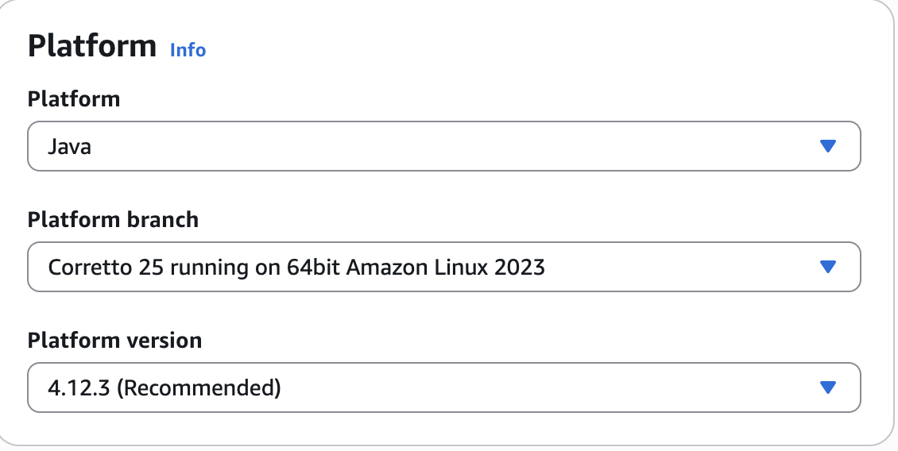
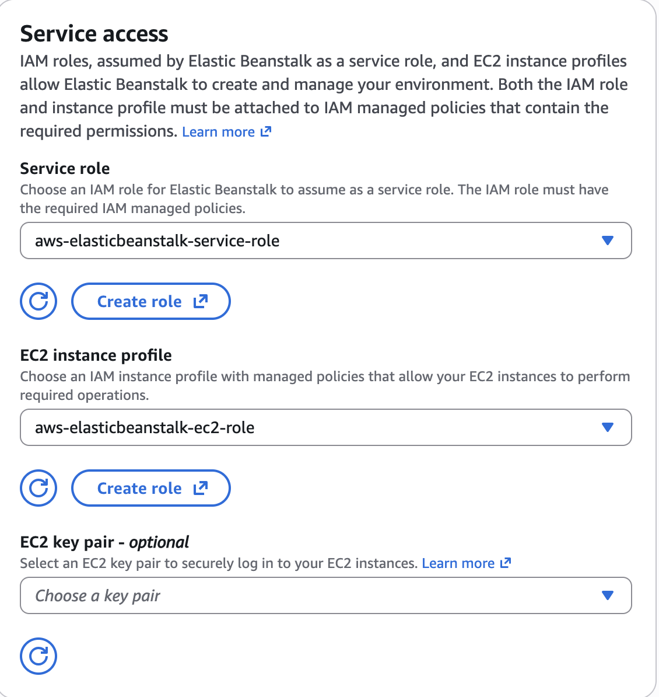
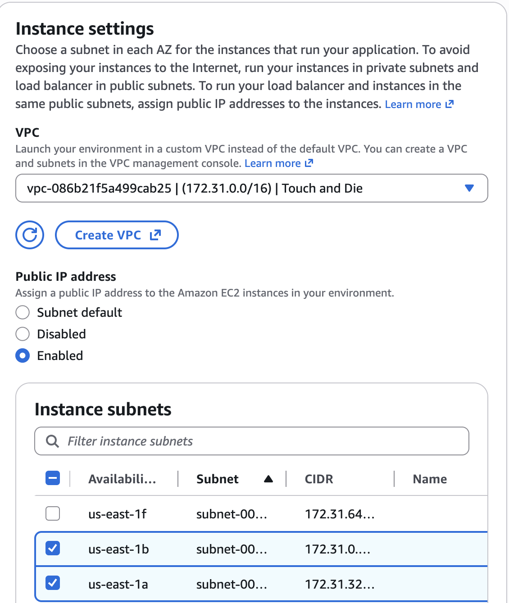
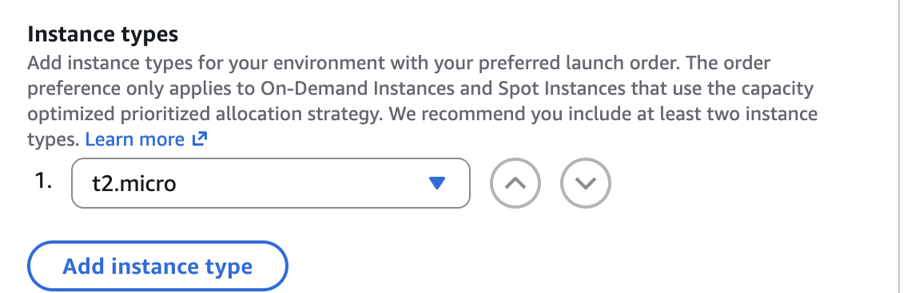
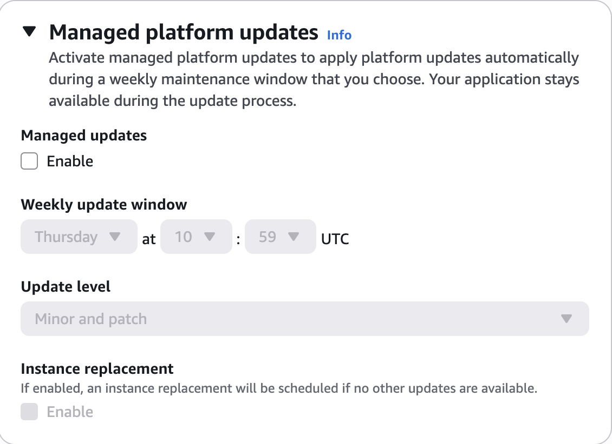
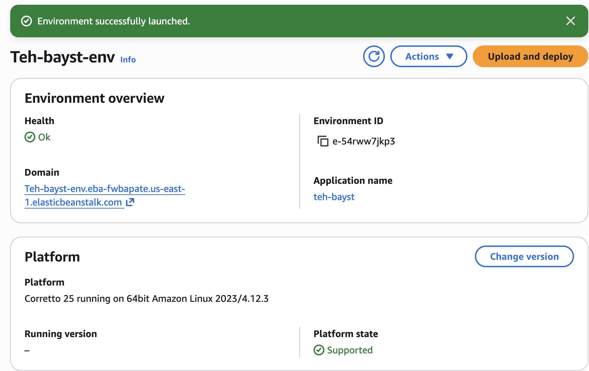
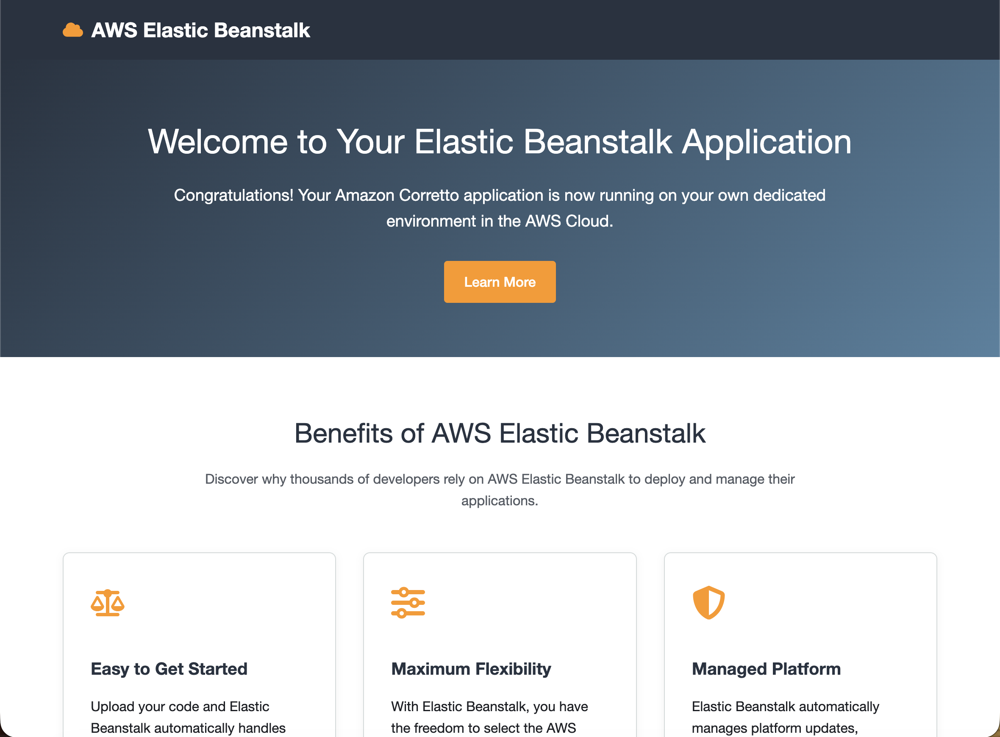
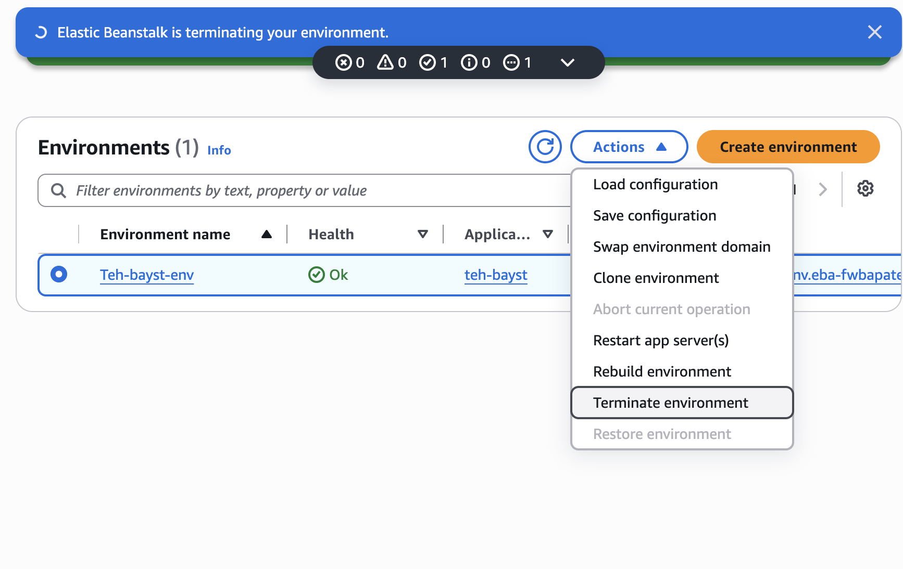
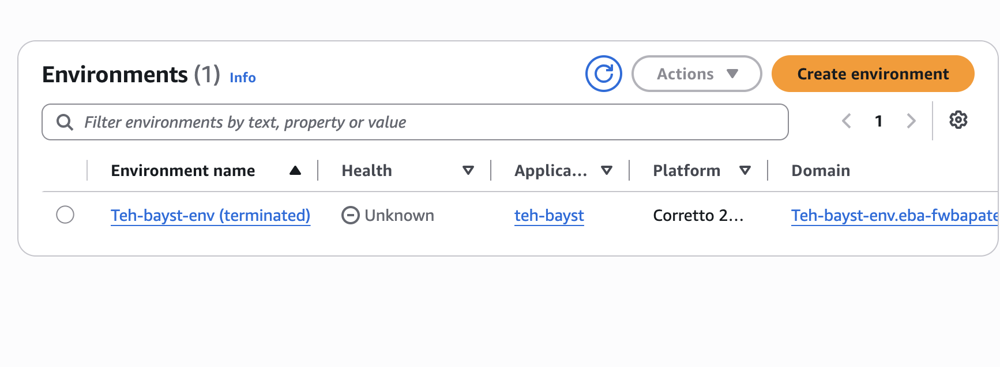

# Runbook

## A. Sign-in
1. Open AWS console
2. Sign- in to your AWS account
3. Choose your AWS Region (us-east-1)

## B. Elastic Beanstalk
1. Navigate to Elastic Beanstalk
2. Click on Create Application
3. Environment tier: Select Web server environment
4. Application name: (whatever you want)
[Images](Images/1.png)

1. Under Platform: Choose Java and leaver other options as default

1. Scroll down and click on the Next button
2. Configure service access: Select the IAM Role (or Create Role)
3. EC2 Instance profile: Select the IAM Role (or Create Role)

1. Scroll down and click on the Next button
2.  Set up networking, database, and tags:
3.  VPC: Select default or any VPC that you created
4.  Public IP address: Choose Enabled
5.  Choose two subnets: us-east-1a and us-east-1b

6.  Keep the rest as default. Scroll down and click Next
7.  Configure instance traffic and scaling:
8.  Scroll down to capacity section and under Instance Types, remove the existing instance types and select t2.micro from the dropdown. 

1.  Click Next
2.  In configuring updates, monitoring, and logging
3.  Scroll down to Managed platform updates section
4.  Uncheck the Managed updated checkbox

1.  Keep the rest as default and click on Next button
2.  Review the details and click on Create button
3.  Wait until the Health is Ok
4.  Then click on the Domain link to see if it is all working

## C. Teardown
1. Return the Environments page
2. On the top right choose Actions
3. In th dropdown, choose Terminate Environment

4. After a few minutes, check to see if your Environment has been terminated, then check for confirmation.
 